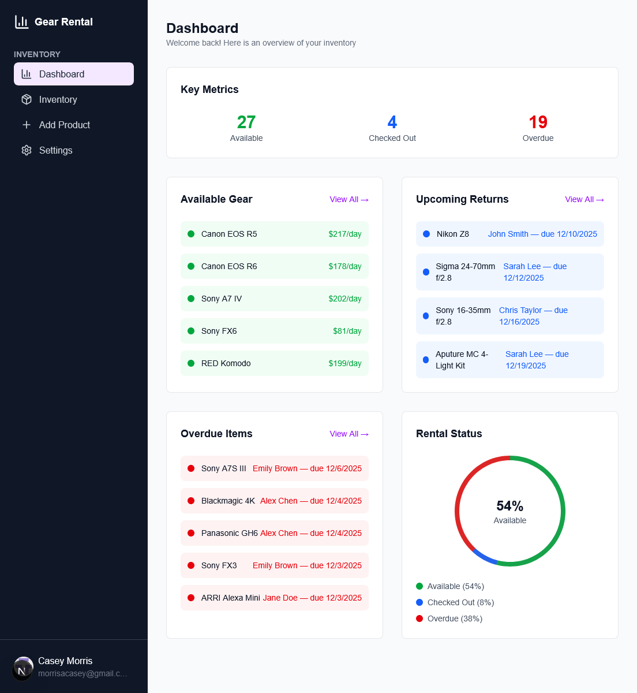
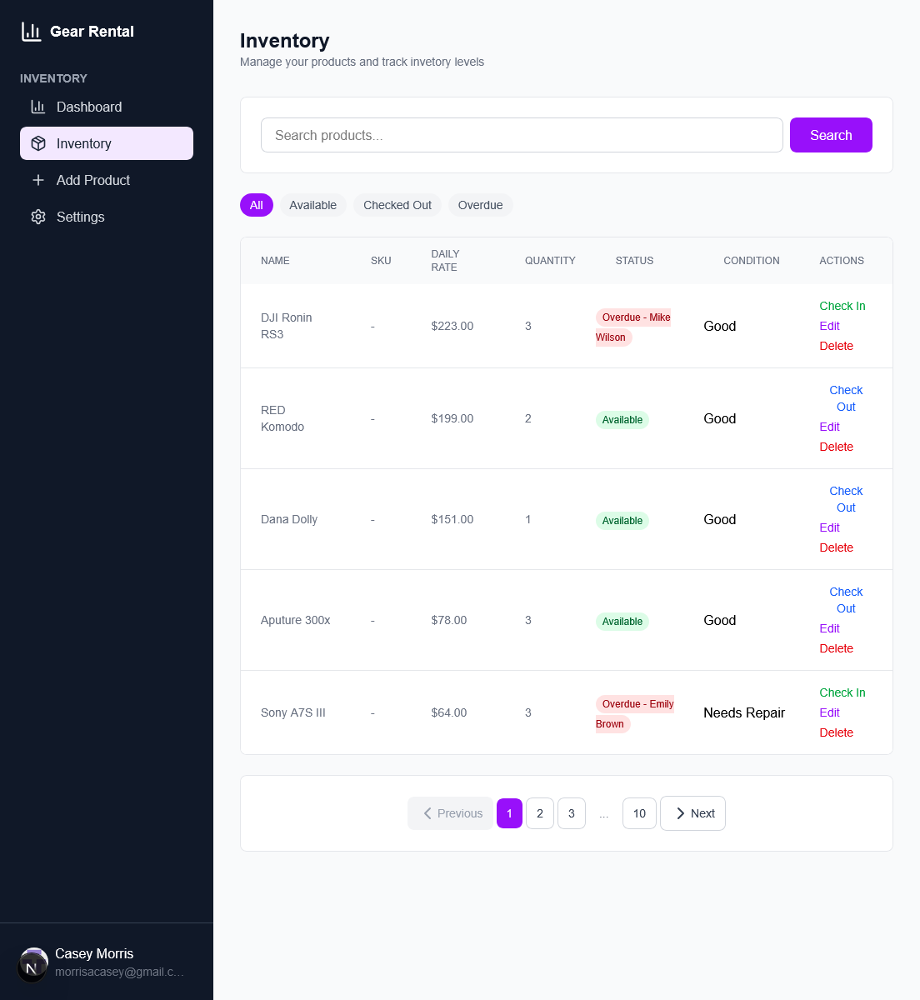
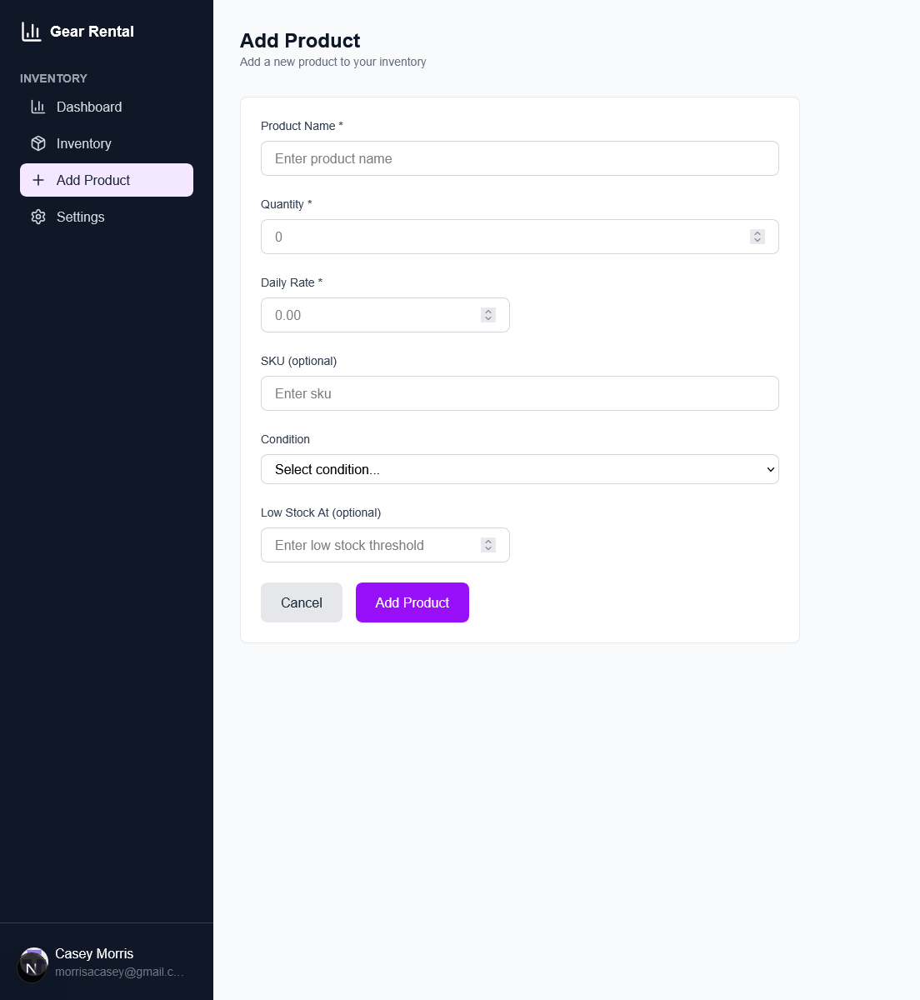

# Gear Rental Inventory

A rental inventory management system built to solve a real business problem: tracking gear availability, managing checkouts, and preventing overdue returns.

## The Problem I Solved

Rental businesses lose money when staff don't know what's available, overdue items slip through the cracks, and inconsistent condition tracking leads to customer disputes. This app provides a single source of truth for rental operations.

## Key Features

- Real-time availability dashboard showing available, checked out, and overdue counts at a glance
- One-click checkout/check-in so staff can process rentals in seconds
- Overdue tracking so late returns never slip through
- Condition logging on every check-in to prevent disputes
- Status filtering to quickly find items by availability

## My Approach

I focused on showing the most critical info immediately: what's overdue, what's coming back soon. Checkout and check-in are single-click actions because rental staff don't have time for multi-step forms. Delete confirmations, required fields, and clear status indicators prevent the kind of mistakes that happen when things get busy.

## Tech Stack

Next.js 15 (App Router, Server Actions), TypeScript, Prisma with PostgreSQL, Stack Auth, and Tailwind CSS.


## Running Locally

```bash
npm install
npx prisma generate
npx prisma db push
npm run dev
```

## Screenshots

### [Dashboard](/app/dashboard/page.tsx)


### [Inventory](/app/inventory/page.tsx)


### [Add Product](/app/add-product/page.tsx)

